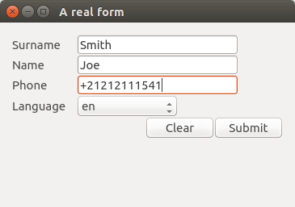

Qml Form Elements
=================

Qml Form Elements is a collection of slightly modified Qt Quick Controls that do collectively behave like a form (inspired by html `<form>`).

The goal is to have input elements that e.g. save data on an `⏎` press.

**Make your QML app keyboard controllable, today!**

Example
-------

You can run the example form with `qmlscene`. No need to compile any C++:

    qmlscene qml-form-elements/main.qml

Supported elements
------------------

* FForm
* FLabel
* FComboBox
* FTextField
* FTextField
* FClearButton
* FSubmitButton

Note
----

This repo is work in progress an should be considered a code sketch.
